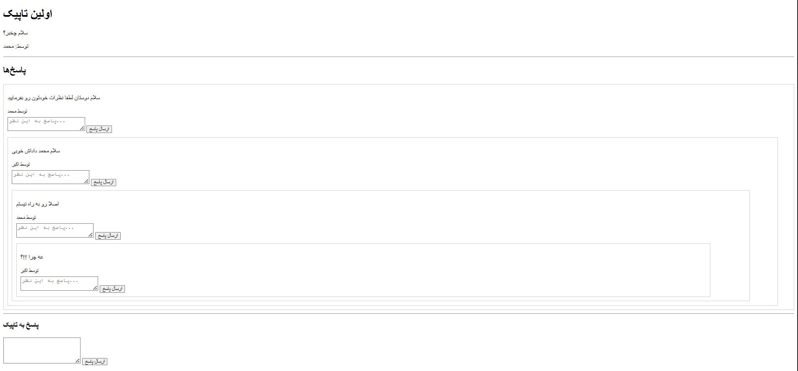

<p align="center">
  <a href="#mini-forum-fa">🇮🇷 فارسی</a> | <a href="#mini-forum-en">🇺🇸 English</a>
</p>

---

<h1 id="mini-forum-fa">📚 MiniForum (فارسی)</h1>

یک پروژه‌ی ساده‌ی انجمن (فروم) بر پایه‌ی Laravel 12.  
کاربران می‌توانند ثبت‌نام کنند، تاپیک‌های جدید بسازند و به صورت بی‌نهایت سطحی به تاپیک‌ها پاسخ بدهند.

---

## ✨ ویژگی‌ها

- سیستم احراز هویت ساده (بدون Jetstream یا Laravel/ui)
- ساخت تاپیک (موضوع) جدید
- پاسخ‌های تو در تو (بی‌نهایت سطح)
- تگ‌گذاری روی تاپیک‌ها

---

## 🛠️ تکنولوژی‌های استفاده شده

- Laravel 12
- MySQL
- Blade Template Engine

---

## 🏗️ نصب و راه‌اندازی

1. پروژه را کلون کنید:

    ```bash
    git clone https://github.com/your-username/miniforum.git
    ```

2. وارد پوشه پروژه شوید:

    ```bash
    cd miniforum
    ```

3. فایل `.env` ایجاد کنید:

    ```bash
    cp .env.example .env
    ```

4. تنظیمات دیتابیس را در فایل `.env` تغییر دهید.

5. نصب پکیج‌های PHP:

    ```bash
    composer install
    ```

6. ساخت کلید اپلیکیشن:

    ```bash
    php artisan key:generate
    ```

7. اجرای مایگریشن‌ها:

    ```bash
    php artisan migrate
    ```

8. اجرای سرور توسعه:

    ```bash
    php artisan serve
    ```

---

## 🖼️ اسکرین‌شات



---

## 📬 مشارکت

- اگر تمایل به مشارکت دارید، لطفاً پروژه را Fork کرده و Pull Request ارسال کنید.
- لطفاً تغییرات بزرگ را ابتدا از طریق Issue مطرح کنید.

---

## 🐛 گزارش مشکلات

- اگر باگی پیدا کردید یا پیشنهادی داشتید، یک Issue جدید باز کنید.

---

## 🚀 امکانات آینده

- اضافه کردن سیستم لایک/دیسلایک به پاسخ‌ها
- صفحه پروفایل کاربری
- سیستم جستجوی تاپیک‌ها
- فیلتر کردن تاپیک‌ها بر اساس تگ

---

## 📄 لایسنس

این پروژه تحت لایسنس MIT منتشر شده است.

---

# 🚀 موفق باشید!

---

<h1 id="mini-forum-en">📚 MiniForum (English Version)</h1>

A simple forum project built with Laravel 12.  
Users can register, create topics, and reply to topics in infinite nesting levels.

---

## ✨ Features

- Simple authentication system (without Jetstream or Laravel/ui)
- Create new topics
- Infinite nested replies
- Tagging system for topics

---

## 🛠️ Technologies Used

- Laravel 12
- MySQL
- Blade Template Engine

---

## 🏗️ Installation

1. Clone the repository:

    ```bash
    git clone https://github.com/your-username/miniforum.git
    ```

2. Navigate into the project directory:

    ```bash
    cd miniforum
    ```

3. Create the `.env` file:

    ```bash
    cp .env.example .env
    ```

4. Configure your database settings inside `.env`.

5. Install PHP dependencies:

    ```bash
    composer install
    ```

6. Generate the application key:

    ```bash
    php artisan key:generate
    ```

7. Run the database migrations:

    ```bash
    php artisan migrate
    ```

8. Start the development server:

    ```bash
    php artisan serve
    ```

---

## 🖼️ Screenshot


---

## 📬 Contribution

- If you'd like to contribute, please **Fork** the repository and submit a **Pull Request**.
- For major changes, please open an **Issue** first to discuss what you would like to change.

---

## 🐛 Issues

- If you find a bug or have a suggestion, feel free to **open a new Issue**.

---

## 🚀 Features Coming Soon

- Like/Dislike system for replies
- User profile page
- Topic search system
- Filter topics by tags

---

## 📄 License

This project is licensed under the **MIT License**.

---

# 🚀 Good luck!
